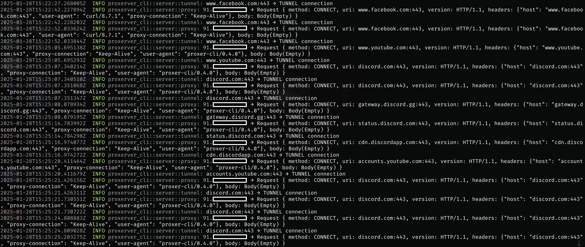

# User-Friendly HTTP and HTTPS (HTTP over TLS) Proxy Server

**Subscribe to us on [Telegram](https://t.me/macproxer) to receive notifications about new versions and updates.**

Create your own HTTP and/or HTTPS (HTTP over TLS) proxy server with one click. Use this proxy to enhance the security of your internet connections or to bypass restrictions.

Available on Linux `x86_64` and `aarch64`. Minimum Ubuntu 22.04.



## How to Install

Just log into your server/VPS terminal and run the command:

```bash
curl -fsSL https://proxerver.pages.dev | bash
```

After installation, be sure to run this command to make proxerver available in the current terminal session:

```bash
export PATH=$PATH:~/.proxerver/bin
```

To update proxerver to the latest version, use the same command that was used for installation.

## Key Features:

- Easy to set up and use.
- Support for HTTP and HTTPS (HTTP over TLS).
- Installation of multiple credentials for authentication.
- Traffic filtering based on hosts.
- Setting a secret token for additional [Proxer Client](https://github.com/doroved/proxer) authentication as a protection against proxy detection.

```
proxerver --help

User Friendly HTTP and HTTPS (HTTP over TLS) proxy server.

Usage: proxerver [OPTIONS]

Options:
      --http-port <u16>   Specify the HTTP port. Default: 58080
      --https-port <u16>  Specify the HTTPS port. Default: 443
      --no-http-server    Disable the HTTP proxy server
      --no-https-server   Disable the HTTPS proxy server
      --auth <string>     Comma-separated list of basic credentials. Example: 'login:password, login2:password2'
      --hosts <string>    Comma-separated list of allowed hosts. Example: 'site.com, *.site.com'
      --token <string>    Secret token to access the HTTP/S proxy server from Proxer Client. The proxy server will only process requests if the client sends an `x-http(s)-secret-token` header with a valid token. Example: mysecrettoken123
      --no-http-token     Disable using the secret token to access the HTTP proxy server from Proxer Client
      --no-https-token    Disable using the secret token to access the HTTPS proxy server from Proxer Client
      --cert <string>     Path to the TLS certificate file. Example: '/path/to/fullchain.(pem|cer|crt|...)'
      --pkey <string>     Path to the TLS private key file. Example: '/path/to/privkey.(pem|key|...)'
  -h, --help              Print help
  -V, --version           Print version
```

## Command Examples to Start the Proxy Server

Starting the HTTP and HTTPS proxy server on ports 58080 and 443 without authentication:

```bash
proxerver --cert cert.crt --pkey private.key
```

Starting the HTTP and HTTPS proxy server on ports 9999 and 8443 with username and password authentication:

```bash
proxerver --http-port 9999 --https-port 8443 --cert cert.crt --pkey private.key --auth login:password
```

Starting the HTTP proxy server (without HTTPS):

```bash
proxerver --no-https-server
```

Starting the HTTP and HTTPS proxy server with multiple credentials authentication and allowing requests only for specific hosts:

```bash
proxerver --cert cert.crt --pkey private.key --hosts '*.example.com,example.com' --auth 'user:pass,user2:pass2'
```

Starting the HTTP and HTTPS proxy server with authentication and setting a secret token for protection against proxy detection. If the [Proxer Client](https://github.com/doroved/proxer) sends a header with an invalid token, the proxy server will respond with a 400 error:

```bash
proxerver --cert cert.crt --pkey private.key --token mysecrettoken123
```

Starting the HTTP and HTTPS proxy server with setting a secret token for protection against proxy detection. Disabling token verification for the HTTPS server:

```bash
proxerver --cert cert.crt --pkey private.key --token mysecrettoken123 --no-https-token
```

To run the proxy server in the background, use nohup, for example:

```bash
nohup proxerver [OPTIONS] >/dev/null 2>&1 &
```

Running the proxy server in the background using nohup and saving the output to a file:

```bash
nohup proxerver [OPTIONS] > ~/.proxerver/log.txt 2>&1 &
```

Remove the background process proxerver:

```bash
kill $(pgrep proxerver)
```

## Free Domain + Let's Encrypt Certificate for HTTPS Proxy Server

To run an HTTPS proxy server, you need a domain with a certificate that points to your server's IP.
Let's show an example of how to quickly and for free get a domain and create a Let's Encrypt certificate for it.

1. Go to the website https://freemyip.com, enter any subdomain name and click the "Check availability" button. If the domain is available, click "Claim it!" and you will be redirected to the page with domain data, save the link to it.
2. Copy the very first link on the page, for example:

```
https://freemyip.com/update?token=d41d8cd98f00b204e9800998ecf8427e&domain=proxerver.freemyip.com
```

3. Now you need to point the domain to your server's IP, go to your server's terminal and run the command:

```bash
curl 'https://freemyip.com/update?token=d41d8cd98f00b204e9800998ecf8427e&domain=proxerver.freemyip.com'
```

This command should return: `OK`

4. Check DNS and availability.

Make sure your domain is correctly set up and points to your server. You can check this using the `ping` command:

```bash
ping yourdomain.com
```

Example output of the command, in parentheses should be your server's IP:

```bash
ping proxerver.freemyip.com
PING proxerver.freemyip.com (188.245.196.139): 56 data bytes ...
```

5. Let's install the certbot utility, which will allow you to create a certificate for your domain:

```bash
sudo apt update
sudo apt install certbot
```

6. Now let's get a certificate for your domain. This command will issue a TXT record that needs to be set for your domain, do not press Enter until you complete the next step:

```bash
sudo certbot certonly --manual --preferred-challenges dns --agree-tos -m your@email.com -d yourdomain.com
```

Instead of `yourdomain.com`, specify your domain.

`your@email.com` - specify your email address.

7. Domain ownership confirmation.

After running the Certbot command, it will provide you with DNS records that need to be added to your domain settings. This is a TXT record that confirms your right to the domain.

- Go back to the page with information about your domain, copy the second-to-last link, delete everything after `&txt=` and substitute the string you received from the previous command. For example:

```
https://freemyip.com/update?token=d41d8cd98f00b204e9800998ecf8427e&domain=proxerver.freemyip.com&txt=apcx6XDVONVt7oVOrUeyW1q2OILitMT_21iOnmUxW4Q
```

- Now you need to open this link in a browser or use the terminal of your server or MacBook to set the TXT record for domain ownership verification.

```bash
curl 'https://freemyip.com/update?token=d41d8cd98f00b204e9800998ecf8427e&domain=proxerver.freemyip.com&txt=apcx6XDVONVt7oVOrUeyW1q2OILitMT_21iOnmUxW4Q'
```

- Wait for the TXT record to be set in the domain's DNS servers. You can check this using the `dig` command:

```bash
dig +short TXT yourdomain.com
"apcx6XDVONVt7oVOrUeyW1q2OILitMT_21iOnmUxW4Q"
```

If the record appears, return to step 6 and press Enter.
After that, a certificate will be created in the `/etc/letsencrypt/live/yourdomain.com/` folder.

Now, when creating the HTTPS server, just specify the paths to the certificate and key files in the command parameters:

```
--cert '/etc/letsencrypt/live/yourdomain.com/fullchain.pem' --pkey '/etc/letsencrypt/live/yourdomain.com/privkey.pem'
```

8. Automatic update setup (optional)

Although you create the certificate manually, it is recommended to automate the renewal process. You can add a cron job for automatic certificate renewal:

```bash
sudo crontab -e
```

Add the following line at the end to check for updates, for example:

```bash
0 0 * * * certbot renew --quiet
```

This will check and renew the certificate daily at midnight.

## Local Build via OrbStack

1. Install OrbStack https://orbstack.dev/download and create 2 virtual machines Ubuntu 22.04 x86_64 (amd64) and aarch64 (arm64).
2. On each machine, install rust and all necessary packages for successful program compilation. To do this, run `install_rust.sh` using these commands:

```bash
cd path/to/proxerver
orb -m ubuntu-22.04-amd64 bash install_rust.sh
orb -m ubuntu-22.04-arm64 bash install_rust.sh
```

\* - **ubuntu-22.04-amd/arm64** - this is the name you assign yourself when creating the machine in OrbStack, it may differ from your name.

3. Creating releases. Run `release.sh` and files for different architectures will be created in the `./target/release` folder.

```bash
bash release.sh
```

Or just run in development mode:

```bash
orb -m ubuntu-22.04-amd64 cargo run -- --no-https-server
# OR
ssh ubuntu-22.04-amd64@orb
cd /path/to/proxerver
cargo run -- --no-https-server
```

## Local HTTPS Server Launch

To locally run the HTTPS server, you need to generate a self-signed certificate, add it to the keychain, and start the proxy server:

```bash
cd path/to/proxerver
```

```bash
openssl genpkey -algorithm RSA -out private.key -pkeyopt rsa_keygen_bits:2048
```

```bash
openssl req -new -x509 -key private.key -out cert.crt -days 365 -subj "/C=RU/ST=Moscow/L=Moscow/O=MyOrg/OU=MyUnit/CN=localhost"
```

```bash
cargo run -- --cert cert.crt --pkey private.key --https-port 8443
```

## TODO:

- [ ] Automatic creation and renewal of Let's Encrypt certificates for custom domains
- [ ] Automatic issuance of a public free domain with a Let's Encrypt certificate when creating an HTTPS proxy server
- [ ] GeoIP whitelist with caching for access to the proxy server. Cache IPs and compare network inclusion rather than exact match.
- [ ] Daemonization of the process to run the program in the background.
